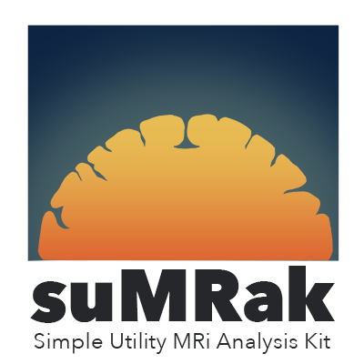

# suMRak

<b> An easier way of processing your MRI data </b>

------------------------------------------------------------------------

 

------------------------------------------------------------------------

suMRak is a MATLAB application created with the sole purpose of simplifying pre-clinical :brain: brain MRI data processing. It is a program intended for research purposes and should not be used in a clinical setting.

------------------------------------------------------------------------

## Installation

suMRak is available in the forms of an App Designer binary .mlapp file and a fully exported MATLAB code .m file which can be both be executed directly from the MATLAB Command Window

It is also available as a single .exe installer file which installs suMRak (and the required MATLAB Runtime) as a standalone application.
> [!IMPORTANT]
> **suMRak is currently compatible with _64-bit Windows 7_ and later**.

The following are prerequisites for installing suMRak on a end-user machine:
- [Microsoft Visual C++ Redistributable 2015-2022](https://learn.microsoft.com/en-us/cpp/windows/latest-supported-vc-redist?view=msvc-170)
- [Python 3.9.13](https://www.python.org/downloads/release/python-3913/) - During installation, select the option to add Python to PATH.

Optional: 
- suMRak uses 

------------------------------------------------------------------------

 ## suMRak Components

suMRak contains many different components, all integrated to work and communicate with each other - thereby reducing the amount of different tools required for getting the information you need from your MRI data to only one.
> [!NOTE]
> suMRak comes with its own carefully written [MANUAL], which explains all of the components in detail and provides recommended workflow steps.

 ------------------------------------------------------------------------

 ### Segmenter

The segmenter tab allows you to easily segment the brain, hemispheres and regions of interest. Use traditional polygonal marking or speed things up using integrated 2D/3D K-means 
clustering - it's your choice.

### Volumetry

Obtain the volumes and slice areas of segmented data with just one click! Simply select one of the saved experiments and all information will be automatically calculated and
displayed accordingly. Segmented regions of interest can also be corrected for edema using one of multiple available correction methods.

### Registration
 
MATLAB's integrated python engine allows suMRak to register saved experiments using the [SimpleElastix](https://simpleelastix.github.io/) python library.

### Parameter Maps

